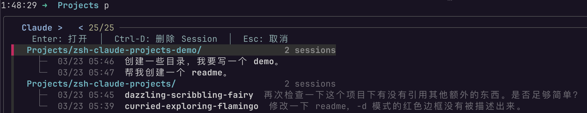
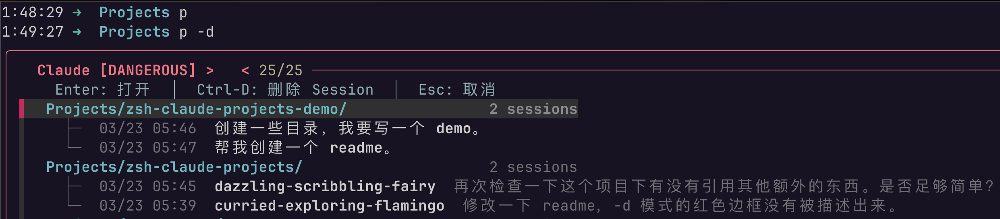

# zsh-claude-projects

A zsh plugin that lets you browse and resume [Claude Code](https://docs.anthropic.com/en/docs/claude-code) sessions with a single keystroke.

```
 myapp/                                           3 sessions
   ├─  03/22 09:37  warm-spinning-galaxy    Add user authentication module
   ├─  03/23 03:51  crisp-flowing-river     Fix pagination bug in /api/users
   └─  03/23 14:01  [No Slug]
 myapp/frontend/                                  2 sessions
   ├─  03/22 16:29  bold-dancing-ember      Refactor Button component props
   └─  03/23 04:57  quiet-drifting-leaf     Set up Tailwind CSS dark mode
```

## Dependencies

| Tool                                                          | Install                                    |
| ------------------------------------------------------------- | ------------------------------------------ |
| [jq](https://jqlang.github.io/jq/)                            | `brew install jq`                          |
| [fzf](https://github.com/junegunn/fzf)                        | `brew install fzf`                         |
| [Claude Code](https://docs.anthropic.com/en/docs/claude-code) | `npm install -g @anthropic-ai/claude-code` |

## Install

```zsh
git clone https://github.com/zhuixinjian/zsh-claude-projects.git ~/.zsh/zsh-claude-projects
echo 'source ~/.zsh/zsh-claude-projects/claude-projects.plugin.zsh' >> ~/.zshrc
```

The default command is `p`. To use a custom name, add this to your `.zshrc` **before** the source line:

```zsh
ZSH_CLAUDE_PROJECTS_ALIAS="pc"   # now use `pc` instead of `p`
```

## Usage

```zsh
❯ p            # browse projects & sessions
❯ p -d         # same, but launch claude with --dangerously-skip-permissions
```

### Normal mode (`p`)



### Danger mode (`p -d`)



A tree-style fzf picker will appear:

| Action                               | Effect                                                           |
| ------------------------------------ | ---------------------------------------------------------------- |
| Select a **project** (directory row) | `cd` into the project and start a new Claude session             |
| Select a **session** (indented row)  | `cd` into the project and resume that session (`claude -r <id>`) |
| `Ctrl-D` on a session                | Delete the session (with confirmation)                           |
| `Esc`                                | Cancel                                                           |

The `-d` flag passes `--dangerously-skip-permissions` to Claude, skipping all permission prompts. The picker will show a red prompt and border as a visual warning. Use with caution.

## How it works

1. Reads `~/.claude/history.jsonl` to discover projects, sorted by most recent activity.
2. For each project, scans `~/.claude/projects/<encoded-path>/*.jsonl` for session files (top 10 by mtime).
3. Extracts the session slug (auto-generated name) and the first real user message as a preview.
4. Pipes everything into fzf for interactive selection.

## Platform

macOS only. Uses BSD `date -j -f` and `stat -f` for timestamp parsing. Contributions for Linux support are welcome.

## License

MIT
